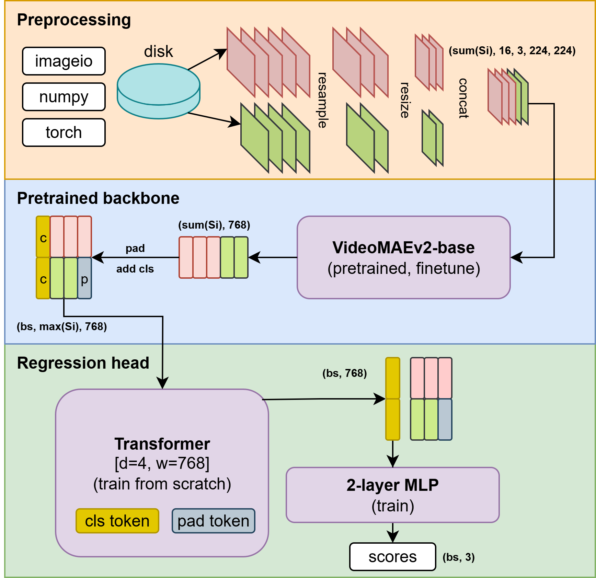

# kandinsky-video-tools
In this repository we release a set of neural networks for video motion analysis that can be used as a part of data curation pipeline for video generation model training and finetuning. This framework includes:

1. [Video Motion Predictor](#video-motion-predictor) - a model able to predict the magnitude of 3 motion categories: camera motion, object motion and other dynamics (change of lighting conditions, color and focus change or blur).

2. [Camera Motion Classifier](#camera-motion-classifier) - a model predicts `18` different camera motion  `'arc_left', 'arc_right',  'dolly_in', 'dolly_out', 'pan_left', 'pan_right',  'pedestal_down',  'pedestal_up', 'roll_left',  'roll_right',  'static', 'tilt_down', 'tilt_up',  'truck_left', 'truck_right',  'undefined', 'zoom_in', 'zoom_out'` and and `3` shot type classes:  `'pov', 'shake',  'track' ` .


## Installation
```properties
conda create -n video_tools python=3.11
conda activate video_tools
pip install -r requirements.txt
```


## Video Motion Predictor

The model accepts a sequence of video frames and returns three float values in range [0, 3] each. These values are different motion scores that describe the magnitude of the changes in the video, namely:

1. ***Camera motion***. Describes the intensity of camera motion.
2. ***Object motion***. Predicts the magnitude of the object's motion, which is not caused by the camera movement. However, sometimes it can be hard to identify, what is actually moving, the camera or the object. In that case the model can be confused.
3. ***Dynamics*** (other motion). This category includes everything that does not fit into 1 and 2. Mostly, it includes lighting, color and focus changes. Interesting to note, that this score is significantly influenced by scene transitions in the video. This property can be used to identify slideshows.

### Training data and loss
The model was trained on a set of 5,000 human annotated video clips with 3 categorical values provided for each sample by 3-5 different people. The average score from all human assessors was used as a target for **regression task with MSE loss**. Videos in the training dataset have a length from 2 to 60 sec. Before being fed to the model they are resampled to FPS=4, which means that one embedding (16 frames) of VideoMAEv2 encode 4 sec of a video. In case of shorter videos, some of the frames are duplicated. During training we update both the pretrained backbone and the regression head.

### Architecture
The backbone of this model is [VideoMAEv2](https://github.com/OpenGVLab/VideoMAEv2), but the regression head is implemented differently in a form of a small transformer (d=4, w=768). The scheme of the model is presented below.

<p align="center">
   
</p>

#### Algorithm:
1. Load video(s) from the disk and decode into frames.
2. **Resample** frames to approx. 4 FPS, while keeping the number of frames divisible by 16 so that VideoMAEv2 backbone can work as intended. Split the video into sequence of segments of 16 frames. Sample same frames multiple times for very short videos (2-4 sec).
3. **Resize** them to the desirable input height and width. The shape of a single video is now `(S, 16, 3, 224, 224)`.
4. Concatenate all the videos along dim=0 to process with the backbone model. `shape[0]` is now `sum(S_i)`.
5. Embed segments of frames with the backbone model. Shape of the embeddings should now be `(sum(S_i), 768)`.
6. Unpack embeddings into sequence for each separate video and pad with trainable `pad_token`. Prepend with `cls_token`. Shape of the batch is now `(bs, S.max(), 768)`.
7. Process the batch with transformer head. Output shape of `cls_token` is (bs, 768), which means we got a single embedding per video.
8. Apply MLP to convert `cls_token` into a tensor of 3 float values. The shape of the final model output is `(bs, 3)`.


### Usage example
Full demo code can be found in [this notebook](demo/video_motion_predictor_demo.ipynb). \
Weights are available on huggingface: [ai-forever/kandinsky-video-motion-predictor](https://huggingface.co/ai-forever/kandinsky-video-motion-predictor).

```python
from models import VideoMotionPredictor

video_path = "../assets/video_motion_predictor/examples/mixed/girl-listens-to-music-and-dances-happily[mixkit].mp4"

model = VideoMotionPredictor.from_pretrained("ai-forever/kandinsky-video-motion-predictor").to("cuda")
pred_dict = model.inference(video_path, return_dict=True)

```


### Possible applications

All the proposed values below should be tuned on your specific dataset to achieve an affordable trade-off between the amount of data preserved and the quality of the filtered data. It's usually helpful to draw distributions of these scores for your dataset and cut them at some threshold.

1. ***Filter out static videos*** \
   This can be done by dropping every sample with all 3 scores being low (for example, `cam < 0.5 & obj < 0.5 & dyn < 1.0`). However, you probably want to check only `cam` and `obj` if you are insterested in physical movement of objects in space.

   https://github.com/user-attachments/assets/06525ba6-8033-4906-bdc6-db777cff5ebf

2. ***Filter out overly dynamic / chaotic videos*** \
   Drop samples with high camera motion (handcamera, shake) and dynamics (unstable lighting, flickering, scene transition). In opposite, high object motion is usually a good sign. Example, `cam > 2.5 and dyn > 2.5`.

3. ***Filter out slideshows*** \
   Slideshows are known to be detrimental for video generation model training. We can reduce their amount in the dataset by filtering samples with low object motion and high dynamics (`obj < 0.5 & dyn > 1.0`). Camera motion can be any, since it's often present in slideshows in a form of zoom-in/-out. Here we use the property of the model to predict high dynamics on videos with scene transition.

4. ***Validation metric*** \
   These motion scores can show if your generative model is able to produce dynamic videos with camera motion and object motion.

---

## Camera Motion Classifier

[VideoMAE model](https://huggingface.co/docs/transformers/model_doc/videomae)(`large`) variant that has been finetuned for multi-label video classification (a video can belong to multiple classes simultaneously) for camera motion classification on internal dataset.


Model was trained to associate **entire video** with camera labels, not frame-level motions(!): [input video] -> label/labels (because multilabel) for all video.  So, if this camera motion exists during all video frames model should predict this motion, otherwise it should predict `undefined`.

The model is configured to process `config.num_frames=16` frames per input clip. These frames are extracted uniformly from the input video, regardless of its original duration. For videos longer than **2 seconds**, processing the entire video as a single clip may miss temporal nuances (e.g., varying camera motions). So, recommended workflow for such videos will be follows:

 (a) split the video into non-overlapping 2-second segments (or sliding windows with optional overlap).

 (b) run inference independently on each segment. 

 (c) post-process results.


 Model accurucy on internal test dataset of 2s videos is **75%**, ignoring `'pov', 'shake', 'track'` classes ~- **84%**.

 ### Usage example
Full demo code can be found in [this notebook](demo/camera_motion_classifier_demo.ipynb). \
Weights are available on huggingface: [ai-forever/kandinsky-videomae-large-camera-motion](https://huggingface.co/ai-forever/kandinsky-videomae-large-camera-motion).

```python
from transformers import (
    VideoMAEImageProcessor, VideoMAEForVideoClassification
)


video_path = "../assets/video_motion_predictor/examples/mixed/girl-listens-to-music-and-dances-happily[mixkit].mp4"

model = VideoMotionPredictor.from_pretrained("ai-forever/kandinsky-video-motion-predictor").to("cuda")
model_ckpt = "ai-forever/kandinsky-videomae-large-camera-motion"
image_processor = VideoMAEImageProcessor.from_pretrained(model_ckpt)

model = VideoMAEForVideoClassification.from_pretrained(model_ckpt).eval().to(device)
# inputs torch.Size([bs, 16, 3, 224, 224])
with torch.no_grad():
   outputs = model(inputs)

logits = outputs.logits.float()
probs = torch.sigmoid(logits).cpu().numpy()[0]  # multi-label

preds = (probs > 0.5).astype(int)
predicted_labels = [model.config.id2label[i] for i, p in enumerate(preds) if p == 1]

```
